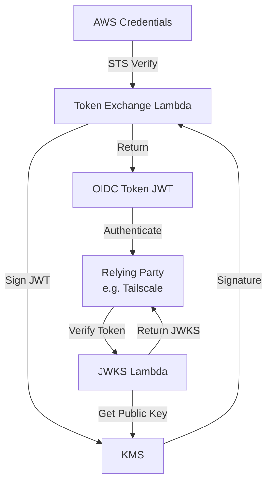
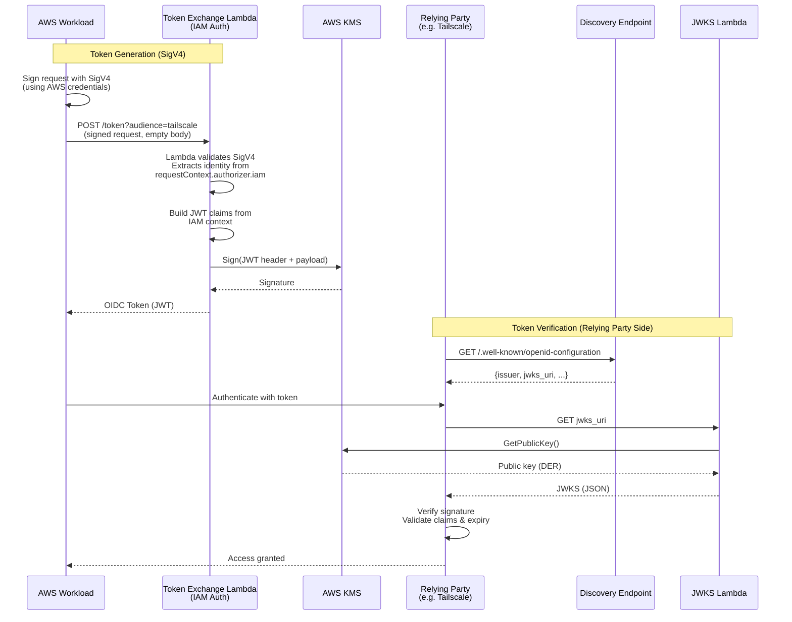

# AWS OIDC Workload Identity

Exchange AWS authentication for OIDC tokens using KMS-backed signing.

## ⚠️ Experimental - Unreviewed Code

**This project is experimental and has not undergone security review.** It is provided as a proof-of-concept implementation for exchanging AWS credentials for OIDC tokens. Before using in production:

- Conduct a thorough security review
- Test extensively in a non-production environment
- Understand the security implications (see [SECURITY.md](./SECURITY.md))
- Review open issues, particularly around token lifetime behavior (see issues)

Use at your own risk. This is not production-ready software.

## What is Workload Identity?

**Workload identity** allows services and applications (workloads) to authenticate themselves using cryptographically verifiable tokens instead of long-lived secrets. Each workload gets a unique identity that can be verified without sharing credentials.

### Why Use Workload Identity?

Traditional authentication with static API keys or passwords has significant drawbacks:
- **Long-lived secrets** that can be stolen or leaked
- **Manual rotation** is error-prone and disruptive
- **Hard to audit** who accessed what and when
- **Difficult to revoke** without breaking other systems

Workload identity solves these problems:
- ✅ **Short-lived tokens** (typically 1 hour) that automatically expire
- ✅ **Cryptographic verification** prevents token forgery
- ✅ **Fine-grained access control** based on verified identity claims
- ✅ **Automatic rotation** - no manual credential management
- ✅ **Complete audit trail** of authentication attempts
- ✅ **Instant revocation** by changing policy, not rotating secrets

### Understanding OIDC Roles

**Workload identity is a general security concept, not an OIDC-specific specification.** It can be implemented using various protocols, including OIDC, SPIFFE, or custom solutions. This project uses OIDC because it's a widely-supported open standard.

In OIDC-based workload identity, there are two key roles defined by the [OpenID Connect specification](https://openid.net/specs/openid-connect-core-1_0.html):

**OpenID Provider (OP)** - Issues signed tokens asserting identities
- Generates and signs JWT tokens with identity claims
- May provide a JWKS endpoint with public keys for verification (optional per spec, but commonly expected)
- May provide a discovery endpoint at `.well-known/openid-configuration` (optional per spec, but commonly expected)
- Examples for workload identity:
  - **This project** (issues OIDC tokens for AWS workloads)
  - **GitHub Actions** (issues OIDC tokens for CI/CD workflows)
  - **Google Cloud** (issues ID tokens for service accounts, Cloud Run, GKE, etc.)
  - **SPIFFE/SPIRE** (service identity framework)

**Relying Party (RP)** - Accepts and verifies tokens to authenticate identities
- Retrieves public keys from the OP (typically via JWKS, but other mechanisms possible)
- Verifies token signatures and validates claims
- Makes authorization decisions based on verified identity
- Examples:
  - **Tailscale** (accepts OIDC tokens for workload authentication)
  - **HashiCorp Vault** (accepts OIDC tokens for secrets access)
  - **AWS** (accepts external OIDC tokens via `AssumeRoleWithWebIdentity`)
  - **Google Cloud** (accepts external OIDC tokens via Workload Identity Federation)
  - **Kubernetes** (verifies service account tokens)

Note: Some systems play both roles. For example, Google Cloud acts as both an OP (issuing tokens for its workloads) and an RP (accepting tokens from GitHub Actions, AWS, etc.).

**This project is an OpenID Provider** - it issues OIDC tokens that assert AWS identities. These tokens can then be used to authenticate with any Relying Party that accepts them.

#### Relevant Specifications

This project implements:
- **[OpenID Connect Core 1.0](https://openid.net/specs/openid-connect-core-1_0.html)** - Defines OP and RP roles, ID Token format, and authentication flows
- **[OpenID Connect Discovery 1.0](https://openid.net/specs/openid-connect-discovery-1_0.html)** - Defines the `.well-known/openid-configuration` endpoint (optional but implemented)
- **[RFC 7519 (JWT)](https://www.rfc-editor.org/rfc/rfc7519)** - JSON Web Token format and claims
- **[RFC 7518 (JWA)](https://www.rfc-editor.org/rfc/rfc7518)** - JSON Web Algorithms (signing algorithms)
  - Requires support for RS256 (RSASSA-PKCS1-v1_5 with SHA-256)
  - Recommends ES256 (ECDSA with P-256 and SHA-256)
- **[RFC 7517 (JWK)](https://www.rfc-editor.org/rfc/rfc7517)** - JSON Web Key format for JWKS endpoint

This project currently implements **RS256** signing, which is the default algorithm recommended by the OIDC specification and required by RFC 7518.

### The Problem: AWS ↔ OIDC Gap

AWS provides excellent support for **OIDC → AWS** authentication (via `AssumeRoleWithWebIdentity`), allowing external OIDC tokens to access AWS resources. In this scenario, **AWS acts as a Relying Party** - it accepts and verifies OIDC tokens from external OpenID Providers.

However, **AWS does not provide the reverse**: AWS does not act as an OpenID Provider for its workloads. There's no built-in way for AWS workloads to obtain OIDC tokens that external services can verify.

This creates a gap: Your AWS workloads (EC2, ECS, Lambda) have strong IAM-based identities, but they can't use them to authenticate with services that only accept OIDC tokens.

### This Project: Bridging the Gap

This project implements a minimal, secure **AWS → OIDC** token exchange service using:
- **AWS KMS** for cryptographic signing (private key never leaves AWS)
- **AWS Lambda** with Function URLs for serverless endpoints
- **AWS SigV4** authentication (no credentials transmitted)

Your AWS workloads can now authenticate with any OIDC-compatible service, such as:
- [Tailscale Workload Identity](https://tailscale.com/blog/workload-identity-beta) - zero-trust networking
- [HashiCorp Vault](https://www.vaultproject.io/) - secrets management
- [Kubernetes](https://kubernetes.io/docs/reference/access-authn-authz/authentication/#openid-connect-tokens) - container orchestration
- Any service accepting OIDC tokens

## Architecture

### High-Level Architecture



### Token Exchange Flow



### Components

1. **KMS Asymmetric Key** (`RSA_2048`)
   - Signs OIDC tokens
   - Private key never leaves KMS
   - Public key exposed via JWKS endpoint

2. **Token Exchange Lambda** (`/token` endpoint, AWS_IAM auth required)
   - Accepts SigV4-signed requests (no credentials in body)
   - Lambda runtime validates SigV4 signature automatically
   - Extracts identity from `requestContext.authorizer.iam`
   - Generates JWT with standard OIDC claims + AWS-specific claims
   - Signs JWT using KMS
   - Returns OIDC-compliant token

3. **JWKS Lambda** (`/jwks.json` endpoint, public)
   - Exposes KMS public key in JWKS format
   - Used by Relying Parties to verify tokens
   - Cached for performance

4. **Discovery Lambda** (`/.well-known/openid-configuration` endpoint, public)
   - OIDC Discovery document for auto-configuration
   - Allows Relying Parties like Tailscale to discover JWKS URL
   - Lists supported algorithms and claims

## Security Properties

- **Cryptographic Security**: Uses AWS KMS with RSA-2048, preventing private key exposure
- **Identity Verification**: AWS SigV4 authentication verified by Lambda runtime before token issuance
- **No Credential Transmission**: Credentials never sent over network - only SigV4 signatures
- **Short-lived Tokens**: Default 1-hour lifetime (configurable)
- **Immutable Audit Trail**: All operations logged to CloudWatch
- **No Stored Secrets**: Everything derives from AWS IAM and KMS
- **Tamper-proof**: JWT signatures cryptographically prevent token modification
- **AWS Native**: Uses standard AWS authentication - works with all AWS credential sources

## Deployment

### Prerequisites

- AWS CLI configured with appropriate credentials
- Bash shell
- Node.js 20+ (for local testing)
- Permissions to create: KMS keys, Lambda functions, IAM roles

### Quick Start

```bash
# Set your issuer URL (this will be in the token 'iss' claim)
export ISSUER="https://your-domain.com"

# Optional: customize stack name and region
export STACK_NAME="aws-oidc-workload-identity"
export AWS_REGION="us-east-1"

# Deploy
npm run deploy
```

The deployment script will:
1. Create a KMS asymmetric signing key
2. Create IAM role with necessary permissions
3. Package and deploy Lambda functions
4. Create Lambda Function URLs
5. Output endpoints for token exchange and JWKS

### Post-Deployment

After deployment, you'll receive two URLs:

```
Token Endpoint: https://abc123.lambda-url.us-east-1.on.aws/
JWKS Endpoint: https://xyz789.lambda-url.us-east-1.on.aws/
```

**Important**: The `ISSUER` environment variable should typically match your token endpoint URL. You may want to:
1. Use a custom domain with CloudFront/API Gateway pointing to these Lambda URLs
2. Update the issuer to match: `export ISSUER=https://your-token-url/` and redeploy

## Usage

### Requesting a Token

The token endpoint requires AWS SigV4 authentication. No credentials are sent in the request body.

**Using the provided client:**

```bash
# Install dependencies
npm install

# Get a token (uses AWS credentials from environment or IAM role)
node client.js https://your-token-url/ tailscale
```

**Using Docker:**

```bash
docker run -e AWS_ACCESS_KEY_ID -e AWS_SECRET_ACCESS_KEY \
  -e AWS_REGION=us-east-1 \
  aws-oidc-token \
  node client.js https://your-token-url/ tailscale
```

**Required IAM Permission:**

```json
{
  "Version": "2012-10-17",
  "Statement": [
    {
      "Effect": "Allow",
      "Action": "lambda:InvokeFunctionUrl",
      "Resource": "arn:aws:lambda:REGION:ACCOUNT:function:STACK-token-exchange"
    }
  ]
}
```

**Response:**

```json
{
  "access_token": "eyJhbGciOiJSUzI1NiIsInR5cCI6IkpXVCIsImtpZCI6I...",
  "token_type": "Bearer",
  "expires_in": 3600
}
```

### Token Claims

The generated JWT includes:

**Standard OIDC Claims:**
- `iss`: Issuer (your configured ISSUER)
- `sub`: Subject (AWS ARN)
- `aud`: Audience (from request or defaults to issuer)
- `iat`: Issued at timestamp
- `exp`: Expiration timestamp

**AWS-Specific Claims:**
- `aws:account`: AWS Account ID
- `aws:arn`: Full AWS ARN
- `aws:userid`: AWS User ID
- `aws:resource_type`: Type (role, user, assumed-role)
- `aws:resource_name`: Resource name
- `aws:access_key`: AWS access key ID used for authentication
- `aws:principal_org`: AWS Organization ID (if applicable)

### Verifying Tokens

Relying Parties can verify tokens using the JWKS endpoint:

```bash
curl https://your-jwks-url/
```

Response:
```json
{
  "keys": [
    {
      "kty": "RSA",
      "use": "sig",
      "alg": "RS256",
      "kid": "abc-123-def",
      "n": "...",
      "e": "AQAB"
    }
  ]
}
```

## Integration with Tailscale

See [docs/tailscale.md](./docs/tailscale.md) for detailed instructions on integrating with Tailscale Workload Identity.

Quick summary:
1. Deploy this solution
2. Configure Tailscale with your OIDC issuer and JWKS URL
3. Use the token endpoint to exchange AWS credentials for OIDC tokens
4. Present tokens to Tailscale for workload authentication

## Testing

### Unit Tests

```bash
# Install dependencies
npm install

# Run unit tests
npm test

# Run unit tests in watch mode
npm run test:watch
```

The unit test suite includes:
- Token generation with SigV4 authentication
- JWKS endpoint functionality
- Discovery endpoint functionality
- Security tests for token tampering
- OIDC compliance tests

### Integration Tests

Test the complete deployment on AWS:

```bash
# Run integration test (deploys, tests, and cleans up)
npm run test:integration

# Keep deployment after test (for manual inspection)
CLEANUP=false npm run test:integration

# Use custom stack name and region
STACK_NAME=my-test-stack AWS_REGION=us-west-2 npm run test:integration
```

The integration test:
1. Deploys all infrastructure to AWS
2. Tests JWKS endpoint (public access)
3. Tests Discovery endpoint (public access)
4. Tests token exchange with SigV4 authentication
5. Verifies token claims match AWS identity
6. Tests error cases (unauthenticated requests)
7. Cleans up all resources

**Note**: Integration tests require valid AWS credentials with permissions to create Lambda functions, KMS keys, and IAM roles.

## Configuration

Environment variables for Lambda functions:

### Token Exchange Lambda

- `KMS_KEY_ID`: KMS key ID or ARN (set by deployment)
- `ISSUER`: Token issuer URL (set by deployment)
- `TOKEN_LIFETIME_SECONDS`: Token lifetime in seconds (default: 3600)

### JWKS Lambda

- `KMS_KEY_ID`: KMS key ID or ARN (set by deployment)

### Discovery Lambda

- `ISSUER`: Token issuer URL (set by deployment)
- `JWKS_URL`: JWKS endpoint URL (set by deployment)

## Cost Considerations

This solution uses serverless components with pay-per-use pricing:

- **Lambda**: Free tier includes 1M requests/month
- **KMS**: $1/month per key + $0.03 per 10,000 signing operations
- **CloudWatch Logs**: Minimal costs for logging

Estimated monthly cost for moderate usage (10k tokens/month): **~$1-2**

## Security Considerations

### Authorization Model

**This service is a domain bridge, not an authorization control.**

Any authenticated AWS identity that can invoke the token exchange Lambda can request a token for any audience. The service does not restrict which audiences a caller can request or enforce access policies. This is by design.

**How Authorization Works:**

1. **Identity Bridge**: This service translates AWS IAM identity into OIDC tokens
2. **Audience Claim**: The caller specifies the intended audience (e.g., `tailscale`, `vault`)
3. **No Enforcement Here**: This service does not validate whether the caller should access that audience
4. **Authorization at Consumer**: The Relying Party (OIDC consumer) makes authorization decisions based on:
   - Token signature verification (proves token authenticity)
   - Claims validation (identity, audience, expiration)
   - Their own access policies (e.g., Tailscale ACLs, Vault policies)

**Example:**

An AWS role `arn:aws:iam::123456789012:role/WebApp` can request tokens for any audience:
- `audience=tailscale` → Token with `aud: tailscale`
- `audience=vault` → Token with `aud: vault`
- `audience=custom-service` → Token with `aud: custom-service`

Each OIDC consumer decides whether to accept the token based on their policies. Tailscale might grant access based on AWS account/role claims, while Vault might have different requirements.

**Security Implications:**

- ✅ Restricting Lambda access controls who can get tokens at all
- ✅ Token claims accurately represent the AWS identity
- ✅ Short-lived tokens limit exposure if intercepted
- ❌ Cannot prevent an authenticated identity from requesting any audience
- ❌ Cannot enforce "which AWS roles can access which services" at token issuance

This matches how other identity providers work (Google Cloud, GitHub Actions) - they issue tokens with verified identity claims, and consumers make authorization decisions.

### Threat Model

**Protected Against:**
- Private key exposure (KMS stores keys in HSMs)
- Token tampering (cryptographic signatures)
- Invalid credential use (SigV4 authentication verified by Lambda)
- Replay attacks (short token lifetime + unique `iat`)

**Not Protected Against:**
- Credential theft (if AWS credentials are stolen, attacker can get tokens)
- Relying Party compromise (tokens are valid if RP is compromised)
- Token interception (use HTTPS for all communications)

### Best Practices

1. **Use Short-Lived Tokens**: Default 1 hour is recommended
2. **Restrict IAM Permissions**: Only allow necessary principals to invoke Lambda
3. **Enable CloudWatch Alarms**: Monitor for unusual token issuance patterns
4. **Rotate KMS Keys**: Periodically rotate KMS keys (requires redeployment)
5. **Use Custom Domains**: Hide Lambda URLs behind CloudFront with WAF
6. **Restrict JWKS Access**: While public, consider rate limiting
7. **Audit Token Claims**: Review what information is included in tokens

### Known Limitations

1. **Not a Hosted Service**: You must operate and monitor this infrastructure
2. **Lambda Cold Starts**: First request after idle period may be slower (~1-2s)
3. **No Token Revocation**: Tokens are valid until expiration (no revocation list)
4. **No Refresh Tokens**: Tokens must be reissued after expiration
5. **Limited Rate Limiting**: Lambda Function URLs have basic throttling but no sophisticated rate limiting
6. **Token Lifetime Semantics Unclear**: The relationship between OIDC token lifetime and resulting credential lifetime in Relying Party systems is not well-defined (see issue #1)

## Cleanup

```bash
npm run destroy
```

This will:
1. Delete Lambda functions and Function URLs
2. Delete IAM role and policies
3. Schedule KMS key deletion (7-day waiting period)
4. Clean up local deployment artifacts

**Note**: KMS keys have a mandatory 7-30 day waiting period before deletion. To cancel:

```bash
aws kms cancel-key-deletion --key-id YOUR_KEY_ID --region us-east-1
```

## Troubleshooting

### Token Exchange Fails with 401

- Verify AWS credentials are valid: `aws sts get-caller-identity`
- Ensure the IAM principal has `lambda:InvokeFunctionUrl` permission
- Check that request is properly signed with SigV4 (client.js handles this automatically)
- Verify the AWS region matches the Lambda function region
- Check CloudWatch logs for the token exchange Lambda

### Token Verification Fails

- Ensure JWKS URL is accessible
- Verify token hasn't expired
- Check that the `kid` in token header matches JWKS
- Confirm token hasn't been modified

### Deployment Fails

- Verify IAM permissions for deployment user
- Check AWS service quotas (Lambda functions, KMS keys)
- Review CloudFormation/deployment logs

## Contributing

Contributions welcome! This is a minimal implementation and can be extended:

- Add API Gateway for better rate limiting and logging
- Implement token caching to reduce KMS calls
- Add CloudFront distribution for custom domains
- Support additional signing algorithms (ES256, etc.)
- Add metrics and monitoring dashboards

## License

MIT

## Acknowledgments

Inspired by the launch of [Tailscale Workload Identity](https://tailscale.com/blog/workload-identity-beta) and wanting to use it on AWS.
