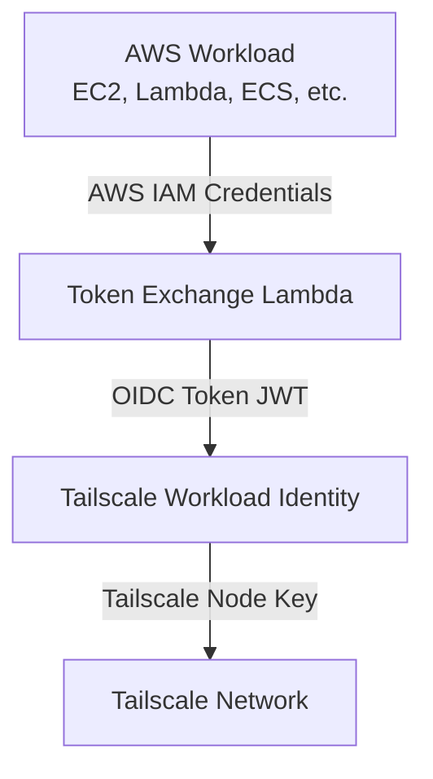

# Tailscale Workload Identity Integration

This guide explains how to integrate AWS OIDC Workload Identity with [Tailscale Workload Identity](https://tailscale.com/blog/workload-identity-beta).

## Overview

Tailscale Workload Identity allows services to authenticate to Tailscale using OIDC tokens instead of auth keys. This provides:
- Cryptographically strong identity verification
- Short-lived credentials (no long-lived secrets)
- Fine-grained access control based on identity claims
- Automatic credential rotation

By combining AWS OIDC Workload Identity with Tailscale, your AWS workloads can securely authenticate to Tailscale using their AWS IAM identity.

## Prerequisites

1. Deploy the AWS OIDC Workload Identity solution (see [README.md](./README.md))
2. A Tailscale account with admin access
3. Tailscale Workload Identity enabled (currently in beta)

## Architecture



## Step 1: Configure Tailscale OIDC Provider

1. Log in to the [Tailscale Admin Console](https://login.tailscale.com/admin)

2. Navigate to **Settings** → **OAuth Clients** → **OIDC Providers**

3. Click **Add OIDC Provider** and configure:

   - **Issuer URL**: Your token endpoint URL (without trailing slash)
     ```
     https://abc123.lambda-url.us-east-1.on.aws
     ```

   - **JWKS URL**: Your JWKS endpoint URL
     ```
     https://xyz789.lambda-url.us-east-1.on.aws
     ```

   - **Client ID**: Leave as default or set custom value (this will be the `aud` claim)

4. Click **Save**

## Step 2: Create Tailscale ACL Policy

Update your Tailscale ACL to grant access based on AWS identity claims.

Example ACL policy:

```json
{
  "acls": [
    {
      "action": "accept",
      "src": ["tag:aws-production"],
      "dst": ["*:*"]
    }
  ],

  "tagOwners": {
    "tag:aws-production": [
      "oidc-provider:aws-oidc-workload-identity"
    ]
  },

  "oidc": {
    "aws-oidc-workload-identity": {
      "issuer": "https://your-token-url/",
      "clientId": "tailscale",
      "claims": {
        "tag:aws-production": {
          "aws:account": ["123456789012"],
          "aws:resource_type": ["role"],
          "aws:resource_name": ["ProductionAppRole"]
        },
        "tag:aws-staging": {
          "aws:account": ["123456789012"],
          "aws:resource_name": ["StagingAppRole"]
        }
      }
    }
  }
}
```

This policy:
- Grants the `tag:aws-production` tag to AWS roles named `ProductionAppRole`
- Grants the `tag:aws-staging` tag to AWS roles named `StagingAppRole`
- Allows all tagged nodes to access the entire network

## Step 3: Configure AWS Workload

### Option A: EC2 Instance

For EC2 instances using instance profile credentials:

```bash
#!/bin/bash

# Get AWS credentials from instance metadata
AWS_REGION="us-east-1"
TOKEN_URL="https://your-token-url/"
TAILSCALE_CLIENT_ID="tailscale"

# Get temporary credentials from EC2 instance metadata
ROLE_NAME=$(curl -s http://169.254.169.254/latest/meta-data/iam/security-credentials/)
CREDENTIALS=$(curl -s http://169.254.169.254/latest/meta-data/iam/security-credentials/$ROLE_NAME)

ACCESS_KEY=$(echo $CREDENTIALS | jq -r '.AccessKeyId')
SECRET_KEY=$(echo $CREDENTIALS | jq -r '.SecretAccessKey')
SESSION_TOKEN=$(echo $CREDENTIALS | jq -r '.Token')

# Exchange for OIDC token
OIDC_RESPONSE=$(curl -s -X POST "$TOKEN_URL" \
  -H "Content-Type: application/json" \
  -d "{
    \"access_key_id\": \"$ACCESS_KEY\",
    \"secret_access_key\": \"$SECRET_KEY\",
    \"session_token\": \"$SESSION_TOKEN\",
    \"audience\": \"$TAILSCALE_CLIENT_ID\"
  }")

OIDC_TOKEN=$(echo $OIDC_RESPONSE | jq -r '.access_token')

# Authenticate to Tailscale using OIDC token
sudo tailscale up --auth-key="oauth:$OIDC_TOKEN"
```

### Option B: ECS Task

Add this to your ECS task definition or startup script:

```bash
#!/bin/bash

TOKEN_URL="https://your-token-url/"
TAILSCALE_CLIENT_ID="tailscale"

# ECS tasks automatically get credentials via AWS_* environment variables
# or from the credential provider endpoint

# Get credentials from environment or credential endpoint
if [ -n "$AWS_CONTAINER_CREDENTIALS_RELATIVE_URI" ]; then
  CREDENTIALS=$(curl -s "http://169.254.170.2$AWS_CONTAINER_CREDENTIALS_RELATIVE_URI")
  ACCESS_KEY=$(echo $CREDENTIALS | jq -r '.AccessKeyId')
  SECRET_KEY=$(echo $CREDENTIALS | jq -r '.SecretAccessKey')
  SESSION_TOKEN=$(echo $CREDENTIALS | jq -r '.Token')
else
  # Use AWS CLI to get credentials
  ACCESS_KEY=$AWS_ACCESS_KEY_ID
  SECRET_KEY=$AWS_SECRET_ACCESS_KEY
  SESSION_TOKEN=$AWS_SESSION_TOKEN
fi

# Exchange for OIDC token
OIDC_RESPONSE=$(curl -s -X POST "$TOKEN_URL" \
  -H "Content-Type: application/json" \
  -d "{
    \"access_key_id\": \"$ACCESS_KEY\",
    \"secret_access_key\": \"$SECRET_KEY\",
    \"session_token\": \"$SESSION_TOKEN\",
    \"audience\": \"$TAILSCALE_CLIENT_ID\"
  }")

OIDC_TOKEN=$(echo $OIDC_RESPONSE | jq -r '.access_token')

# Start Tailscale
tailscaled --tun=userspace-networking --socket=/var/run/tailscale/tailscaled.sock &
tailscale up --auth-key="oauth:$OIDC_TOKEN"
```

### Option C: Lambda Function

For Lambda functions that need to connect to Tailscale:

```javascript
const { STSClient, AssumeRoleCommand } = require('@aws-sdk/client-sts');
const https = require('https');

async function getTailscaleOIDCToken(audience = 'tailscale') {
  // Lambda functions automatically have AWS credentials
  const sts = new STSClient({});
  const identity = await sts.send(new AssumeRoleCommand({
    RoleArn: process.env.AWS_ROLE_ARN,
    RoleSessionName: 'lambda-tailscale-session'
  }));

  const tokenUrl = process.env.TOKEN_URL;

  const postData = JSON.stringify({
    access_key_id: identity.Credentials.AccessKeyId,
    secret_access_key: identity.Credentials.SecretAccessKey,
    session_token: identity.Credentials.SessionToken,
    audience: audience
  });

  return new Promise((resolve, reject) => {
    const req = https.request(tokenUrl, {
      method: 'POST',
      headers: {
        'Content-Type': 'application/json',
        'Content-Length': postData.length
      }
    }, (res) => {
      let data = '';
      res.on('data', (chunk) => data += chunk);
      res.on('end', () => {
        const response = JSON.parse(data);
        resolve(response.access_token);
      });
    });

    req.on('error', reject);
    req.write(postData);
    req.end();
  });
}

exports.handler = async (event) => {
  const oidcToken = await getTailscaleOIDCToken();
  // Use oidcToken to authenticate to Tailscale
  // ...
};
```

## Step 4: Verify Integration

### Test Token Exchange

```bash
# Get AWS credentials (example using AWS CLI)
export AWS_ACCESS_KEY_ID="your-access-key"
export AWS_SECRET_ACCESS_KEY="your-secret-key"
export AWS_SESSION_TOKEN="your-session-token"  # if using temporary credentials

# Exchange for OIDC token
curl -X POST https://your-token-url/ \
  -H "Content-Type: application/json" \
  -d "{
    \"access_key_id\": \"$AWS_ACCESS_KEY_ID\",
    \"secret_access_key\": \"$AWS_SECRET_ACCESS_KEY\",
    \"session_token\": \"$AWS_SESSION_TOKEN\",
    \"audience\": \"tailscale\"
  }" | jq
```

Expected response:
```json
{
  "access_token": "eyJhbGciOiJSUzI1NiIsInR5cCI6IkpXVCIsImtpZCI6I...",
  "token_type": "Bearer",
  "expires_in": 3600
}
```

### Verify Token Claims

Decode the token to verify claims (use [jwt.io](https://jwt.io) or a local tool):

```bash
TOKEN="eyJhbGciOiJSUzI1NiIsInR5cCI6IkpXVCIsImtpZCI6I..."
echo $TOKEN | cut -d'.' -f2 | base64 -d | jq
```

Verify:
- `iss` matches your issuer URL
- `aud` matches your Tailscale client ID
- `aws:account`, `aws:arn`, `aws:resource_name` are correct
- `exp` is in the future

### Test Tailscale Connection

```bash
# Authenticate to Tailscale with OIDC token
OIDC_TOKEN="your-oidc-token"
sudo tailscale up --auth-key="oauth:$OIDC_TOKEN"

# Verify connection
tailscale status
```

## Automation Examples

### Systemd Service

Create `/etc/systemd/system/tailscale-oidc.service`:

```ini
[Unit]
Description=Tailscale with AWS OIDC Authentication
After=network.target

[Service]
Type=oneshot
ExecStart=/usr/local/bin/tailscale-oidc-connect.sh
RemainAfterExit=yes
StandardOutput=journal

[Install]
WantedBy=multi-user.target
```

Create `/usr/local/bin/tailscale-oidc-connect.sh`:

```bash
#!/bin/bash
set -e

# Configuration
TOKEN_URL="https://your-token-url/"
TAILSCALE_CLIENT_ID="tailscale"

# Get EC2 instance role credentials
ROLE_NAME=$(curl -s http://169.254.169.254/latest/meta-data/iam/security-credentials/)
CREDENTIALS=$(curl -s http://169.254.169.254/latest/meta-data/iam/security-credentials/$ROLE_NAME)

ACCESS_KEY=$(echo $CREDENTIALS | jq -r '.AccessKeyId')
SECRET_KEY=$(echo $CREDENTIALS | jq -r '.SecretAccessKey')
SESSION_TOKEN=$(echo $CREDENTIALS | jq -r '.Token')

# Exchange for OIDC token
OIDC_RESPONSE=$(curl -s -X POST "$TOKEN_URL" \
  -H "Content-Type: application/json" \
  -d "{
    \"access_key_id\": \"$ACCESS_KEY\",
    \"secret_access_key\": \"$SECRET_KEY\",
    \"session_token\": \"$SESSION_TOKEN\",
    \"audience\": \"$TAILSCALE_CLIENT_ID\"
  }")

OIDC_TOKEN=$(echo $OIDC_RESPONSE | jq -r '.access_token')

# Connect to Tailscale
tailscale up --auth-key="oauth:$OIDC_TOKEN" --accept-routes
```

Enable the service:

```bash
chmod +x /usr/local/bin/tailscale-oidc-connect.sh
systemctl enable tailscale-oidc
systemctl start tailscale-oidc
```

### Cron Job for Token Refresh

Since tokens expire after 1 hour, you may want to refresh the connection periodically:

```cron
# Refresh Tailscale connection every 30 minutes
*/30 * * * * /usr/local/bin/tailscale-oidc-connect.sh
```

## Troubleshooting

### Token Exchange Fails

**Symptom**: 401 error from token endpoint

**Solutions**:
- Verify AWS credentials are valid: `aws sts get-caller-identity`
- Check that the IAM role has necessary permissions
- Review CloudWatch logs for the token exchange Lambda

### Tailscale Rejects OIDC Token

**Symptom**: `tailscale up` fails with authentication error

**Solutions**:
- Verify JWKS URL is accessible from Tailscale: `curl https://your-jwks-url/`
- Check that token hasn't expired
- Verify ACL policy allows your AWS identity
- Ensure `aud` claim matches Tailscale client ID

### Token Expired

**Symptom**: Connection drops after 1 hour

**Solutions**:
- Implement automatic token refresh (see automation examples)
- Consider running a background job to refresh tokens
- Tailscale should automatically handle token expiration, but manual refresh may be needed

### ACL Policy Not Working

**Symptom**: Node appears in Tailscale but has no tags or access

**Solutions**:
- Verify ACL policy syntax in Tailscale admin console
- Check that claim values match exactly (case-sensitive)
- Review token claims to ensure they match ACL policy
- Test ACL policy with Tailscale's ACL testing tool

## Best Practices

1. **Use Specific Audience**: Set `audience` to your Tailscale client ID for additional security
2. **Implement Token Refresh**: Tokens expire after 1 hour; implement automatic refresh
3. **Least Privilege ACLs**: Grant minimum necessary access based on AWS identity
4. **Monitor Token Usage**: Set up CloudWatch alarms for unusual token issuance
5. **Use Service Accounts**: For automated systems, use dedicated IAM roles
6. **Test ACL Changes**: Always test ACL policy changes in staging first
7. **Document Identity Mappings**: Maintain documentation of which AWS roles map to which Tailscale tags

## Security Considerations

### Identity Binding

- Tokens are cryptographically bound to AWS identity via STS verification
- Each token includes the full AWS ARN in the `sub` claim
- Tailscale can verify tokens using the public JWKS endpoint

### Token Lifetime

- Default 1-hour lifetime limits exposure window
- Shorter lifetimes increase security but require more frequent refresh
- Balance between security and operational overhead

### Credential Protection

- Never log or expose AWS credentials or OIDC tokens
- Use HTTPS for all token exchange requests
- Store tokens in memory only, never on disk
- Rotate AWS credentials regularly

### Network Security

- Token exchange Lambda uses Function URLs (HTTPS only)
- JWKS endpoint is public but read-only
- Consider placing Lambda behind CloudFront with WAF
- Use VPC endpoints for Lambda if needed

## Additional Resources

- [Tailscale Workload Identity Documentation](https://tailscale.com/kb/1250/workload-identity)
- [Tailscale ACL Documentation](https://tailscale.com/kb/1018/acls)
- [AWS IAM Roles Documentation](https://docs.aws.amazon.com/IAM/latest/UserGuide/id_roles.html)
- [OIDC Specification](https://openid.net/specs/openid-connect-core-1_0.html)
