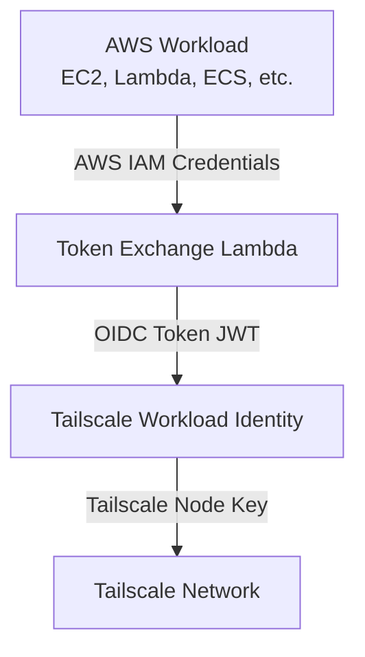

# Tailscale Workload Identity Integration

This guide shows how to configure [Tailscale Workload Identity](https://tailscale.com/blog/workload-identity-beta) to authenticate AWS workloads using OIDC tokens generated from their AWS IAM identities.

Instead of using long-lived Tailscale auth keys, your EC2 instances, ECS tasks, and Lambda functions can authenticate to Tailscale using their native AWS identity.

## Prerequisites

1. Deploy the AWS OIDC Workload Identity solution (see [README.md](./README.md))
2. A Tailscale account with admin access
3. Tailscale Workload Identity enabled (currently in beta)

## Architecture



## Step 1: Configure Tailscale OIDC Provider

1. Log in to the [Tailscale Admin Console](https://login.tailscale.com/admin)

2. Navigate to **Settings** → **OAuth Clients** → **OIDC Providers**

3. Click **Add OIDC Provider** and configure:

   - **Issuer URL**: Your token endpoint URL (without trailing slash)
     ```
     https://abc123.lambda-url.us-east-1.on.aws
     ```

   - **Discovery URL** (optional): If Tailscale supports OIDC discovery
     ```
     https://discovery123.lambda-url.us-east-1.on.aws/.well-known/openid-configuration
     ```

   - **JWKS URL**: Your JWKS endpoint URL (or auto-discovered from discovery endpoint)
     ```
     https://xyz789.lambda-url.us-east-1.on.aws
     ```

   - **Client ID**: Set to `tailscale` (this will be the `aud` claim)

4. Click **Save**

## Step 2: Create Tailscale ACL Policy

Update your Tailscale ACL to grant access based on AWS identity claims.

Example ACL policy:

```json
{
  "acls": [
    {
      "action": "accept",
      "src": ["tag:aws-production"],
      "dst": ["*:*"]
    }
  ],

  "tagOwners": {
    "tag:aws-production": [
      "oidc-provider:aws-oidc-workload-identity"
    ]
  },

  "oidc": {
    "aws-oidc-workload-identity": {
      "issuer": "https://your-token-url/",
      "clientId": "tailscale",
      "claims": {
        "tag:aws-production": {
          "aws:account": ["123456789012"],
          "aws:resource_type": ["role"],
          "aws:resource_name": ["ProductionAppRole"]
        },
        "tag:aws-staging": {
          "aws:account": ["123456789012"],
          "aws:resource_name": ["StagingAppRole"]
        }
      }
    }
  }
}
```

This policy:
- Grants the `tag:aws-production` tag to AWS roles named `ProductionAppRole`
- Grants the `tag:aws-staging` tag to AWS roles named `StagingAppRole`
- Allows all tagged nodes to access the entire network

## Step 3: Configure AWS Workload

### Option A: EC2 Instance

For EC2 instances using instance profile credentials:

```bash
#!/bin/bash
set -e

# Configuration
export AWS_REGION="us-east-1"
TOKEN_URL="https://your-token-url/"
AUDIENCE="tailscale"

# Install Node.js if not present
if ! command -v node &> /dev/null; then
    curl -fsSL https://deb.nodesource.com/setup_20.x | sudo -E bash -
    sudo apt-get install -y nodejs
fi

# Install aws-oidc-token client
npm install -g @aws-sdk/credential-provider-node @smithy/signature-v4 @smithy/protocol-http @aws-crypto/sha256-js

# Download client.js from your deployment or copy it to the instance
curl -O https://raw.githubusercontent.com/latacora/aws-oidc-workload-identity/main/client.js

# Get OIDC token using instance profile credentials (automatic)
OIDC_RESPONSE=$(node client.js "$TOKEN_URL" "$AUDIENCE")
OIDC_TOKEN=$(echo "$OIDC_RESPONSE" | jq -r '.access_token')

# Authenticate to Tailscale using OIDC token
sudo tailscale up --auth-key="oauth:$OIDC_TOKEN"
```

The client.js automatically uses EC2 instance profile credentials - no need to extract them manually.

### Option B: ECS Task or Docker

Use the provided Docker image and docker-compose.yml as a sidecar:

**docker-compose.yml:**
```yaml
version: '3.8'

services:
  # OIDC token fetcher sidecar
  oidc-token:
    image: ghcr.io/latacora/aws-oidc-token:latest
    environment:
      # AWS credentials from ECS task role (automatic)
      - AWS_REGION=${AWS_REGION:-us-east-1}
      - TOKEN_URL=https://your-token-url/
      - AUDIENCE=tailscale
    command: >
      sh -c 'while true; do
        node client.js $$TOKEN_URL $$AUDIENCE > /tmp/token.json;
        sleep 3000;
      done'
    volumes:
      - token-data:/tmp

  # Your application
  app:
    image: your-app:latest
    volumes:
      - token-data:/tmp
    depends_on:
      - oidc-token

volumes:
  token-data:
```

The sidecar automatically fetches tokens using the ECS task role credentials.

### Option C: Lambda Function

For Lambda functions that need to connect to Tailscale, bundle the client code with your Lambda:

```javascript
const { defaultProvider } = require('@aws-sdk/credential-provider-node');
const { SignatureV4 } = require('@smithy/signature-v4');
const { HttpRequest } = require('@smithy/protocol-http');
const { Sha256 } = require('@aws-crypto/sha256-js');
const https = require('https');

async function getOIDCToken(tokenUrl, audience = 'tailscale') {
  const url = new URL(tokenUrl);
  if (audience) {
    url.searchParams.set('audience', audience);
  }

  const credentials = await defaultProvider()();

  const request = new HttpRequest({
    method: 'POST',
    protocol: url.protocol,
    hostname: url.hostname,
    path: url.pathname + url.search,
    headers: {
      'host': url.hostname,
      'content-type': 'application/json'
    }
  });

  const signer = new SignatureV4({
    credentials,
    region: process.env.AWS_REGION || 'us-east-1',
    service: 'lambda',
    sha256: Sha256
  });

  const signedRequest = await signer.sign(request);

  return new Promise((resolve, reject) => {
    const req = https.request({
      hostname: signedRequest.hostname,
      path: signedRequest.path,
      method: signedRequest.method,
      headers: signedRequest.headers
    }, (res) => {
      let data = '';
      res.on('data', (chunk) => data += chunk);
      res.on('end', () => resolve(JSON.parse(data)));
    });
    req.on('error', reject);
    req.end();
  });
}

exports.handler = async (event) => {
  const tokenResponse = await getOIDCToken(process.env.TOKEN_URL, 'tailscale');
  const oidcToken = tokenResponse.access_token;
  // Use oidcToken to authenticate to Tailscale
  // ...
};
```

**Required IAM Permission** on the Lambda execution role:
```json
{
  "Version": "2012-10-17",
  "Statement": [
    {
      "Effect": "Allow",
      "Action": "lambda:InvokeFunctionUrl",
      "Resource": "arn:aws:lambda:REGION:ACCOUNT:function:STACK-token-exchange"
    }
  ]
}
```

## Step 4: Verify Integration

### Test Token Exchange

```bash
# Ensure AWS credentials are configured
export AWS_REGION="us-east-1"

# Test with client.js (uses AWS credential chain automatically)
node client.js https://your-token-url/ tailscale | jq

# Or test that you can reach the token endpoint (will fail without SigV4 auth)
aws sts get-caller-identity  # Verify your AWS identity first
```

Expected response:
```json
{
  "access_token": "eyJhbGciOiJSUzI1NiIsInR5cCI6IkpXVCIsImtpZCI6I...",
  "token_type": "Bearer",
  "expires_in": 3600
}
```

**Note**: The token endpoint requires AWS SigV4 authentication, so direct curl requests without signing will fail with 401. Always use client.js or implement SigV4 signing.

### Verify Token Claims

Decode the token to verify claims (use [jwt.io](https://jwt.io) or a local tool):

```bash
TOKEN="eyJhbGciOiJSUzI1NiIsInR5cCI6IkpXVCIsImtpZCI6I..."
echo $TOKEN | cut -d'.' -f2 | base64 -d | jq
```

Verify:
- `iss` matches your issuer URL
- `aud` matches your Tailscale client ID
- `aws:account`, `aws:arn`, `aws:resource_name` are correct
- `exp` is in the future

### Test Tailscale Connection

```bash
# Authenticate to Tailscale with OIDC token
OIDC_TOKEN="your-oidc-token"
sudo tailscale up --auth-key="oauth:$OIDC_TOKEN"

# Verify connection
tailscale status
```

## Automation Examples

### Systemd Service

Create `/etc/systemd/system/tailscale-oidc.service`:

```ini
[Unit]
Description=Tailscale with AWS OIDC Authentication
After=network.target

[Service]
Type=oneshot
ExecStart=/usr/local/bin/tailscale-oidc-connect.sh
RemainAfterExit=yes
StandardOutput=journal

[Install]
WantedBy=multi-user.target
```

Create `/usr/local/bin/tailscale-oidc-connect.sh`:

```bash
#!/bin/bash
set -e

# Configuration
export AWS_REGION="us-east-1"
TOKEN_URL="https://your-token-url/"
AUDIENCE="tailscale"
CLIENT_PATH="/opt/aws-oidc-token/client.js"

# Get OIDC token (uses EC2 instance profile automatically)
OIDC_RESPONSE=$(node "$CLIENT_PATH" "$TOKEN_URL" "$AUDIENCE")
OIDC_TOKEN=$(echo "$OIDC_RESPONSE" | jq -r '.access_token')

# Connect to Tailscale
tailscale up --auth-key="oauth:$OIDC_TOKEN" --accept-routes
```

Enable the service:

```bash
chmod +x /usr/local/bin/tailscale-oidc-connect.sh
systemctl enable tailscale-oidc
systemctl start tailscale-oidc
```

### Cron Job for Token Refresh

Since tokens expire after 1 hour, you may want to refresh the connection periodically:

```cron
# Refresh Tailscale connection every 30 minutes
*/30 * * * * /usr/local/bin/tailscale-oidc-connect.sh
```

## Troubleshooting

### Token Exchange Fails

**Symptom**: 401 error from token endpoint

**Solutions**:
- Verify AWS credentials are valid: `aws sts get-caller-identity`
- Ensure the IAM principal has `lambda:InvokeFunctionUrl` permission for the token exchange Lambda
- Confirm the request is properly signed with SigV4 (client.js handles this automatically)
- Verify AWS_REGION environment variable matches the Lambda function region
- Review CloudWatch logs for the token exchange Lambda

### Tailscale Rejects OIDC Token

**Symptom**: `tailscale up` fails with authentication error

**Solutions**:
- Verify JWKS URL is accessible from Tailscale: `curl https://your-jwks-url/`
- Check that token hasn't expired
- Verify ACL policy allows your AWS identity
- Ensure `aud` claim matches Tailscale client ID

### Token Expired

**Symptom**: Connection drops after 1 hour

**Solutions**:
- Implement automatic token refresh (see automation examples)
- Consider running a background job to refresh tokens
- Tailscale should automatically handle token expiration, but manual refresh may be needed

### ACL Policy Not Working

**Symptom**: Node appears in Tailscale but has no tags or access

**Solutions**:
- Verify ACL policy syntax in Tailscale admin console
- Check that claim values match exactly (case-sensitive)
- Review token claims to ensure they match ACL policy
- Test ACL policy with Tailscale's ACL testing tool

## Best Practices

1. **Use Specific Audience**: Set `audience` to your Tailscale client ID for additional security
2. **Implement Token Refresh**: Tokens expire after 1 hour; implement automatic refresh
3. **Least Privilege ACLs**: Grant minimum necessary access based on AWS identity
4. **Monitor Token Usage**: Set up CloudWatch alarms for unusual token issuance
5. **Use Service Accounts**: For automated systems, use dedicated IAM roles
6. **Test ACL Changes**: Always test ACL policy changes in staging first
7. **Document Identity Mappings**: Maintain documentation of which AWS roles map to which Tailscale tags

## Security Considerations

### Identity Binding

- Tokens are cryptographically bound to AWS identity via SigV4 authentication
- Lambda Function URL validates SigV4 signatures and provides identity in IAM context
- No credentials transmitted over network - only SigV4 signatures
- Each token includes the full AWS ARN in the `sub` claim
- Tailscale can verify tokens using the public JWKS endpoint

### Token Lifetime

- Default 1-hour lifetime limits exposure window
- Shorter lifetimes increase security but require more frequent refresh
- Balance between security and operational overhead

### Credential Protection

- AWS credentials never transmitted over network (SigV4 signs requests locally)
- Never log or expose OIDC tokens
- All token exchange requests use HTTPS with SigV4 authentication
- Store tokens in memory only, never on disk
- Rotate AWS credentials regularly
- Use IAM roles instead of long-lived credentials when possible

### Network Security

- Token exchange Lambda uses Function URLs (HTTPS only)
- JWKS endpoint is public but read-only
- Consider placing Lambda behind CloudFront with WAF
- Use VPC endpoints for Lambda if needed

## Additional Resources

- [Tailscale Workload Identity Documentation](https://tailscale.com/kb/1250/workload-identity)
- [Tailscale ACL Documentation](https://tailscale.com/kb/1018/acls)
- [AWS IAM Roles Documentation](https://docs.aws.amazon.com/IAM/latest/UserGuide/id_roles.html)
- [OIDC Specification](https://openid.net/specs/openid-connect-core-1_0.html)
